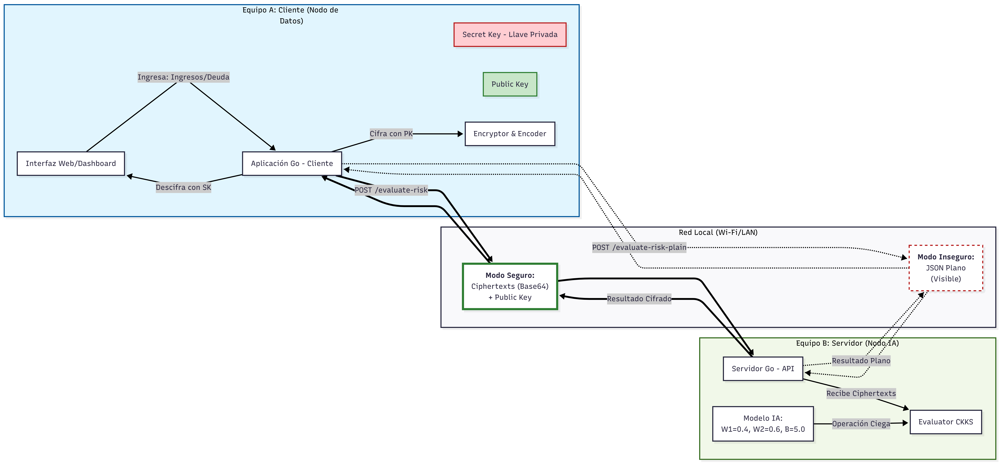

# 🛡️ LattiGO Risk Dashboard




Un dashboard de evaluación de riesgo financiero diseñado para demostrar la diferencia extrema entre **transmitir datos en texto plano** y utilizar **Cifrado Homomórfico (FHE)**. 

Este proyecto fue estructurado especialmente para analizar capturas de red (por ejemplo, con **Wireshark**) y demostrar cómo el cifrado homomórfico, mediante la librería Lattigo, protege los datos analíticos mientras se computan en el lado del servidor sin llegar a ser descifrados en el backend.

---

## 🚀 Requisitos Previos

Asegúrate de tener instalados los siguientes componentes antes de iniciar:

- **[Go (Golang)](https://go.dev/)**: Versión 1.20 o superior.
- **Un navegador web moderno**: Chrome, Firefox, Edge o Safari.
- *(Opcional)* **[Wireshark](https://www.wireshark.org/)**: Si deseas analizar e inspeccionar los paquetes y observar las diferencias entre ambos modelos de transferencia.

---

## ⚙️ Instrucciones de Uso

### 1. Iniciar el Servidor Backend (Go)

El servidor procesa el modelo de riesgo. Dispone de dos endpoints: el convencional (inseguro/plano) y el cifrado con FHE.

1. Abre tu terminal favorita (Powershell, CMD, Bash).
2. Ubícate en el directorio raíz del proyecto `LattiGO`.
3. Ejecuta el servidor corriendo el siguiente comando:

```bash
go run server/main.go
```

> **Verificación:** Deberías ver en la consola el siguiente mensaje indicando que el servidor está a la escucha:
> `=== Servidor de IA (Equipo B) Iniciado ===`
> `Escuchando en http://localhost:8080/evaluate-risk`

### 2. Visualizar la Interfaz de Usuario (Dashboard)

No requieres de un servidor complejo para abrir el entorno visual. Todo es estático usando Vanilla Web Technologies (HTML/CSS/JS).

1. Abre tu **Explorador de Archivos** y dirígete al directorio donde clonaste o pusiste la carpeta del proyecto.
2. Haz **doble clic** sobre el archivo llamado `index.html`.
3. Esto abrirá la interfaz directamente en tu navegador por defecto (verás en la barra de direcciones algo como `file:///C:/Users/.../LattiGO/index.html`).

> 💡 **Tip Pro:** También puedes instalar extensiones como _"Live Server"_ en VSCode para autovaciado de caché o montar un servidor local en Python (`python -m http.server 3000`), aunque **no es estrictamente necesario**.

---

## 🧪 Cómo realizar la Demo

1. Estando en el Dashboard (`index.html`), asegúrate de que el backend está corriendo.
2. Activa tu software de monitoreo de red (ej. Wireshark, filtrando por `port 8080`).
3. Ve a la sección del **Modo Inseguro**:
   * Ingresa datos, envía la solicitud y *observa en Wireshark* cómo todos los detalles de Ingreso y Deuda viajan legibles.
4. Cambia a la sección de evaluación **Cifrada (FHE)**:
   * Realiza la misma operación y mira la magia: todos los datos en tu captura de red lucirán como enormes bloques ininteligibles (base64 de *Ciphertexts*). El servidor computará el riesgo y devolverá el veredicto sin comprometer ni un solo dato.

---
*Hecho con precisión y seguridad matemática.* 🔏
